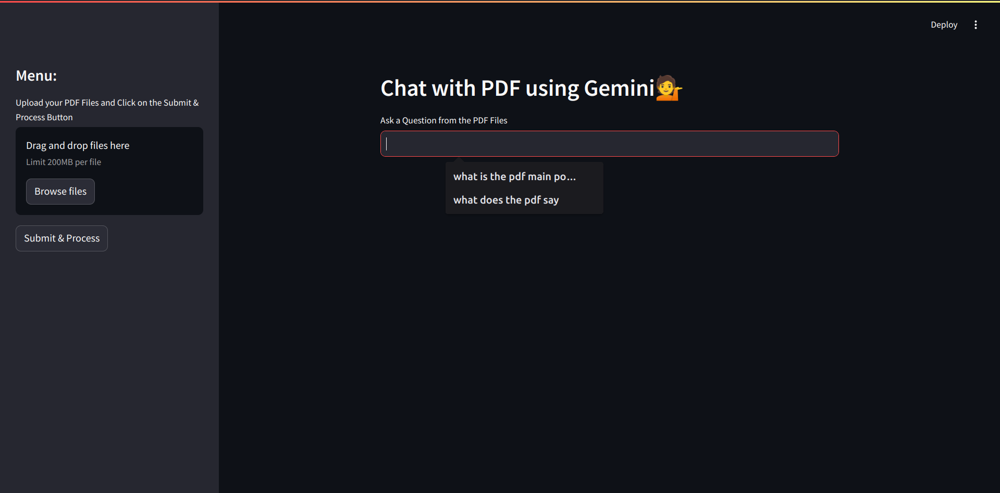

# README

## Overview

This repository contains a PDF analyzer application built in Python. The application uses LangChain and features a user interface built with Streamlit. The application allows users to upload PDF files, process them, and ask questions about the content.

## Description

The PDF analyzer is designed to help users interact with the content of PDF files. It leverages the capabilities of LangChain and Google Generative AI to provide detailed answers to user queries based on the content of the uploaded PDFs.

### Key Features

- **PDF Text Extraction**: Extracts text from uploaded PDF files.
- **Text Chunking**: Splits the extracted text into manageable chunks for processing.
- **Vector Store Creation**: Creates a vector store from the text chunks for efficient similarity search.
- **Conversational Chain**: Uses a conversational chain to generate detailed answers to user queries based on the context provided by the PDF content.
- **Streamlit Interface**: Provides a user-friendly interface for uploading PDFs, asking questions, and viewing responses.

3. **Interact with the Application**:
- Open the URL provided by Streamlit in your web browser.
- Upload PDF files using the file uploader in the sidebar.

## Current Issues

There is a known issue with getting an output due to the use of a legacy approach in the code. The `ConversationBufferMemory` class is deprecated.The  issue need to be addressed to ensure the application functions correctly.

**An image showing the UI**

## Conclusion

This PDF analyzer application demonstrates how to use LangChain and Google Generative AI to create a powerful tool for interacting with PDF content. While there are some current issues due to legacy code, the application provides a solid foundation for further development and improvement.
